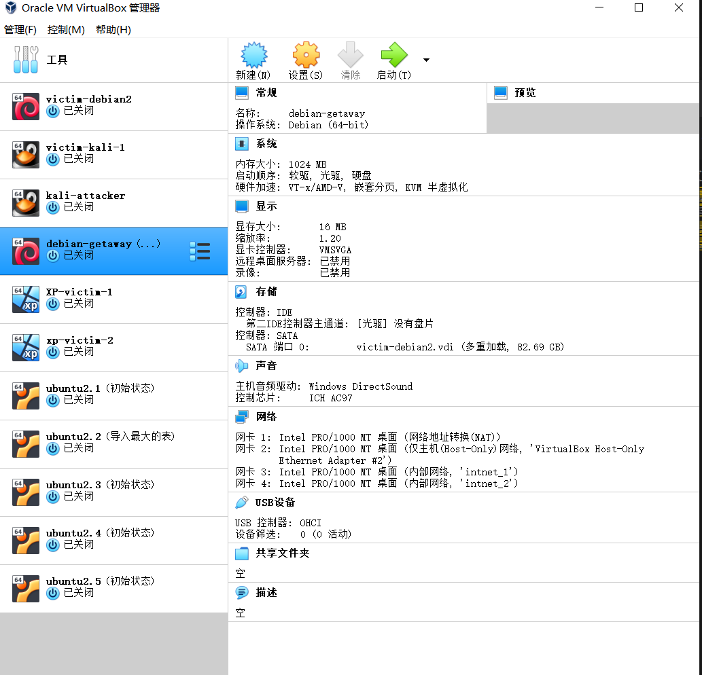
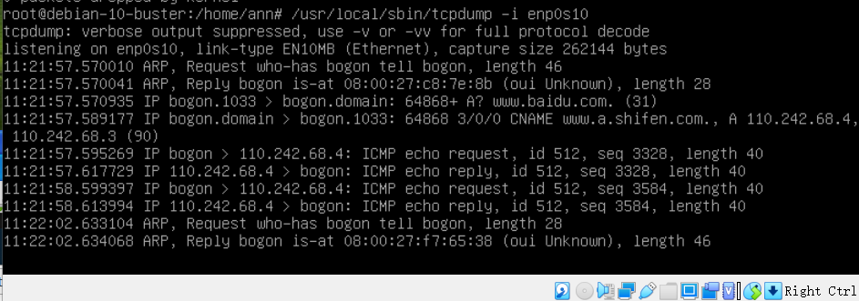

## 实验一：基于 VirtualBox 的网络攻防基础环境搭建

### 实验目的
* 掌握 VirtualBox 虚拟机的安装与使用
* 掌握 VirtualBox 的虚拟网络类型和按需配置 
* 掌握 VirtualBox 的虚拟硬盘多重加载 
### 实验环境
* VirtualBox 虚拟机
* 攻击者主机（Attacker）：Kali Rolling 2020.3
* 网关（Gateway, GW）：Debian Buster
* 靶机（Victim）： xp-sp3 / Kali 

### 实验要求
* [ √ ] 靶机可以直接访问攻击者主机

* [ √ ] 攻击者主机无法直接访问靶机

* [ √ ] 网关可以直接访问攻击者主机和靶机

* [ √ ] 靶机的所有对外上下行流量必须经过网关

* [ √ ] 所有节点均可以访问互联网 

### 实验过程

#### 1. 虚拟机配置 
* 安装系统 
    * debian 
        * GRUB boot loader安装位置：/dev/sda 
    * kali
        * 版本选择Oracle(64-bit)
* 多重加载
  管理->虚拟介质管理->把类型改为多重加载->释放盘片 
  
* 虚拟机配置结果  
   

#### 2. 网络设置 
网络拓扑图 
   
##### 2.1 网关配置(Debian-gateway) 
四块网卡配置：
* NAT网络：网关可以访问攻击者主机
* Host-Only：方便使用ssh
* 两块内部网络：搭建两个独立的局域网intnet_1和intnet_2 
   
```
  #用户切换
su

#修改配置文件
vi /etc/network/interfaces

#重启
/sbin/ifup enp0s9
/sbin/ifup enp0s10
sudo systemctl restart networking

#安装dnsmasq
apt-get update  
apt-get install dnsmasq 

#修改/etc/dnsmasq.d/gw-enp09.conf
interface=enp0s9
dhcp-range=172.16.111.10,172.16.111.150,240h


#修改/etc/dnsmasq.d/gw-enp10.conf
interface=enp0s10
dhcp-range=172.16.222.10,172.16.222.150,240h

#备份dnsmasq.conf文件
cp dnsmasq.conf dnsmasq.conf.bak

#修改dnsmasq.conf文件
#log-dhcp--->log-dhcp
#log-queries--->log-queries
#在log-queries下面加一条命令
log-facility=/var/log/dnsmasq.log

#重启dnsmasq
/etc/init.d/dnsmasq restart 
``` 
网卡配置结果：
    
##### 2.2 靶机配置 
* xp配置时将控制芯片改成```Intel Pro/1000T``` 服务器 
   

* Debian和Kali靶机只需要将网络改为拓扑图对应的内部网络。 
各个靶机的ip：
   
   
   
   
归纳各个系统的ip地址： 

|名称 | ip |
|:--|:--|
|debian-getaway<1> |10.0.2.15  |
|debian-getaway<2> | 192.168.56.102/24 | 
|debian-getaway<3>  | 172.16.111.1/24 | 
|debian-getaway<4>  | 172.16.222.1/24 | 
|victim-kali-1  | 172.16.111.108/24 | 
|xp-victim-1  | 172.16.111.130/24 | 
|xp-victim-2  | 172.16.222.128/24 | 
|victim-debian2  | 172.16.222.147/24 | 

#### 3. 网络连通性测试 
##### 1. 靶机可以直接访问攻击者主机 
kali-victim-1访问kali-attacker 
   
Debian-victim-2访问kali-attacker
   
xp-victim-1访问kali-attacker
    
xp-victim-2访问kali-attacker
    
##### 2. 攻击者主机无法直接访问靶机 
    
##### 3. 网关可以直接访问攻击者主机和靶机 
    
    
##### 4.靶机的所有对外上下行流量必须经过网关&所有节点均可以访问互联网 
在网关上安装tcpdump，并对对应网卡进行监控。在各个节点上访问互联网，观察捕获到了上下行的包，说明靶机的所有对外上下行流量必须经过网关。 
``` 
apt insatll tcpdump
/usr/sbin/tcpdump -i enp0s8 # etc
``` 

网关可以访问互联网： 
    
kali-attacker可以访问互联网
    
victim-kali-1可以访问互联网
    
上下行流量经过网关： 
    
victim-debian2可以访问互联网
    
上下行流量经过网关： 
    
xp-victim-1可以访问互联网
    
上下行流量经过网关： 
    
xp-victim-2可以访问互联网
    
上下行流量经过网关： 
    

#### 参考资料 
* https://www.bilibili.com/video/BV16t4y1i7rz?p=12 
* https://github.com/CUCCS/2020-ns-public-Crrrln/blob/chap0x01/chap0x01/
* https://github.com/CUCCS/2020-ns-public-LyuLumos/blob/ch0x01/ch0x01/
