## 网络安全第十一章实验报告 

### 实验目的

* 了解蜜罐的分类和基本原理
* 了解不同类型蜜罐的适用场合
* 掌握常见蜜罐的搭建和使用

### 实验环境 

* 实验拓扑

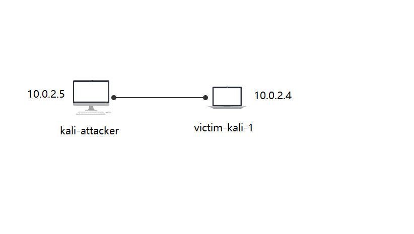 

* ssh-Honeypot
* cowrie 

### 实验要求 

* [ √ ] 记录蜜罐的详细搭建过程；
* [ √ ] 使用 nmap 扫描搭建好的蜜罐并分析扫描结果，同时分析「 nmap 扫描期间」蜜罐上记录得到的信息；
* [ √ ] 如何辨别当前目标是一个「蜜罐」？以自己搭建的蜜罐为例进行说明；
* [ √ ]（可选）总结常见的蜜罐识别和检测方法；
### 实验过程 

* 在victim-kali-1中搭建蜜罐，attacker模仿攻击者。 

#### ssh-Honeypot 
* 一种极低交互式的简易蜜罐 
* 安装过程 

安装docker

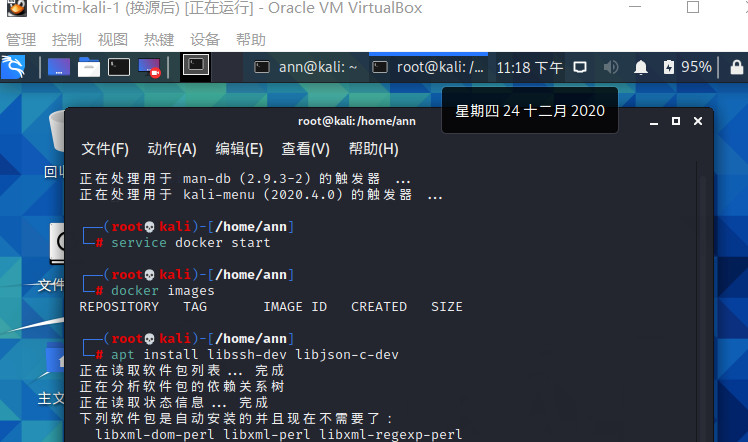

安装docker-ssh-honeypot

```
git clone https://github.com/random-robbie/docker-ssh-honey
docker build . -t local:ssh-honeypot#构建镜像
docker run -p 2234:22 local:ssh-honeypot# 运行镜像 格式为本地端口:容器端口 
docker exec -i -t id bash #进入容器
tail -F ssh-honeypot.log#查看日志
```

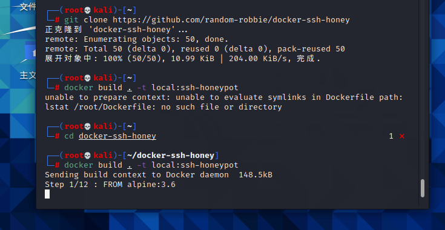 

运行镜像并通过docker ps查看容器的id

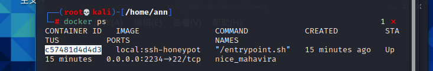 
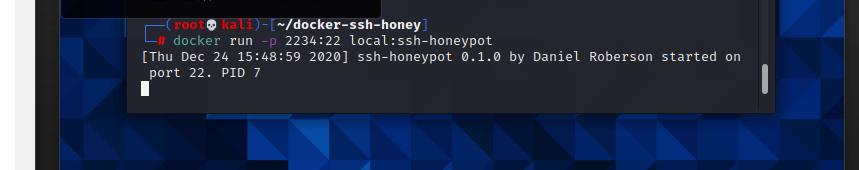 

* 实验过程

  * 进入容器并查看日志来检查攻击者的行为

ssh连接被记录

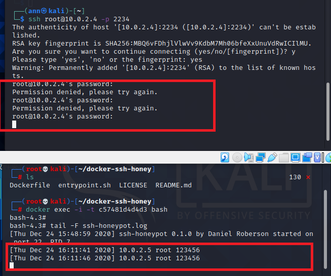 

无论输什么密码，连接都会被拒绝。

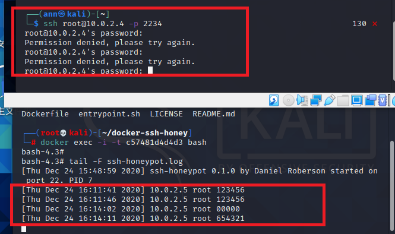 

ssh-honeypot是一个低交互式的蜜罐，能完成的功能有限，但是日志能记录下所有攻击者的行为，如输入的密码等等，以及攻击者的ip也展露无遗，这达到了蜜罐的初步目标，即收集对方的信息。 

接着attacker对目标主机进行nmap端口扫描，我们发现日志信息中并没有记录下，说明该蜜罐并未对此生效，也再一次说明了该蜜罐的低交互式，只是一个可以简单记录ssh连接的简易蜜罐。

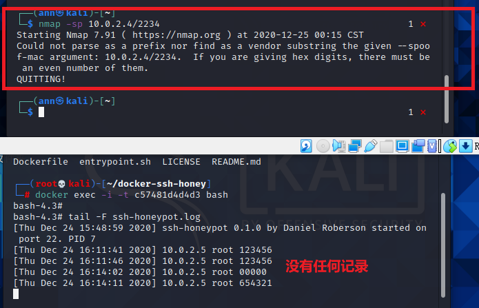


#### Cowrie 

* owrie是一种中到高交互性的SSH和Telnet蜜罐，旨在记录暴力攻击和攻击者执行的shell交互。在中等交互模式（shell）下，它以Python仿真UNIX系统；在高级交互模式（代理）下，它充当SSH和telnet代理，以观察攻击者对另一个系统的行为。 
* Cowrie选择以仿真外壳运行（默认）：具有添加/删除文件功能的伪造文件系统。包含类似于Debian 5.0安装的完整伪造文件系统可能添加伪造的文件内容，以便攻击者可以监视/ etc / passwd等文件。仅包含最少的文件内容Cowrie保存使用wget / curl下载的文件或通过SFTP和scp上传的文件，以供以后检查；或将SSH和telnet代理到另一个系统:作为具有监控功能的纯telnet和ssh代理运行或者让Cowrie管理Qemu虚拟服务器池以提供登录到的系统。
* 在docker中安装Cowrie 

```docker pull cowrie/cowrie```

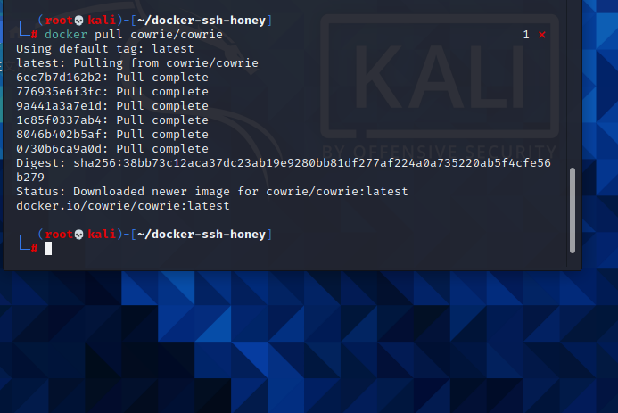 

* 启动cowrie，在端口2222开启，同时在attacker中进行ssh连接攻击者，发现日志信息已经记录下了所有行为 

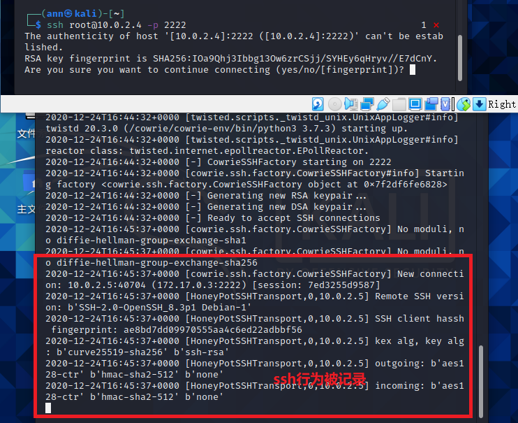 

* 对于root用户使用任意密码登录，发现输任意密码都可以登录。由此可见，蜜罐的安全性必须保证，否则攻击者输入的是一段恶意代码，很有可能最后蜜罐反被当成“肉机”

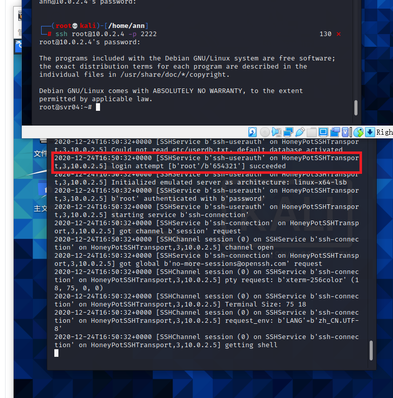 

* 不使用root用户使用普通用户，发现在输入多次密码后被拒绝连接，猜想该蜜罐设置了不允许非root用户连接

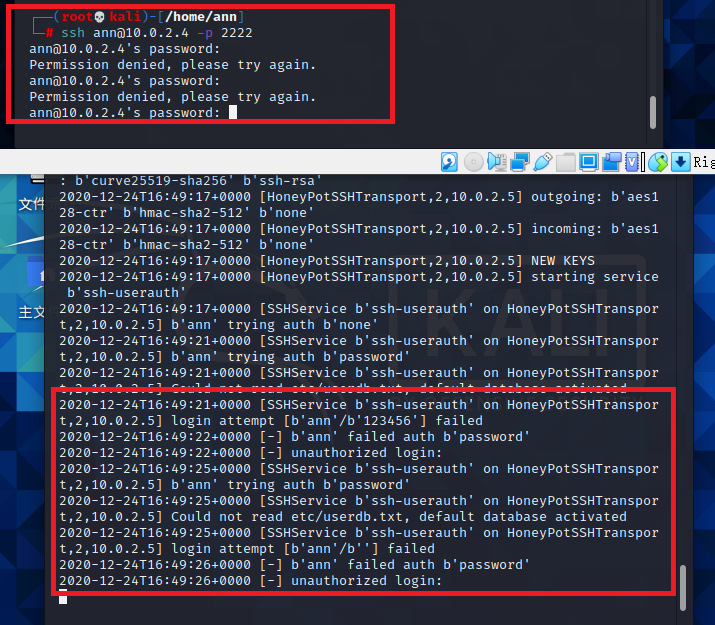 

* 实验发现，没过多久，ssh连接就自动断开了，说明该蜜罐有设置连接时间限制，可能也是出于自我保护（但是动不动断开还是很让人起疑）

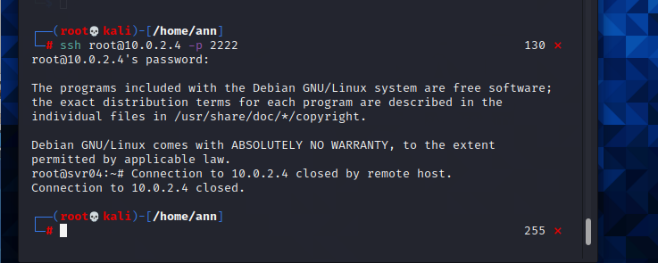 

* 查看cowrie的日志文件，先进入容器，并查看日志所在目录，查看日志文件。在日志中可以看到刚刚的attacker连接的时间，ip等等信息。

```
docker exec -i -t container_id bash #进入容器
cat cowrie.json #查看日志
```

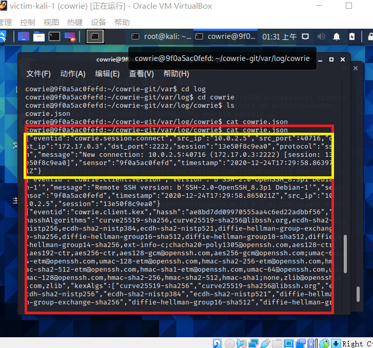 

* 在ssh连接的状态下，攻击者进行基本的连通性测试操作，发现ping和curl指令都正常运行了

```
ping www.baidu.com #ping百度
curl http://www.baidu.com/helloworld
```

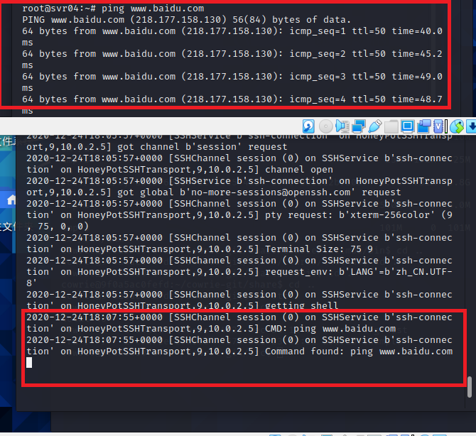 

 

* 执行apt-get指令下载snort包，看起来好像没问题 

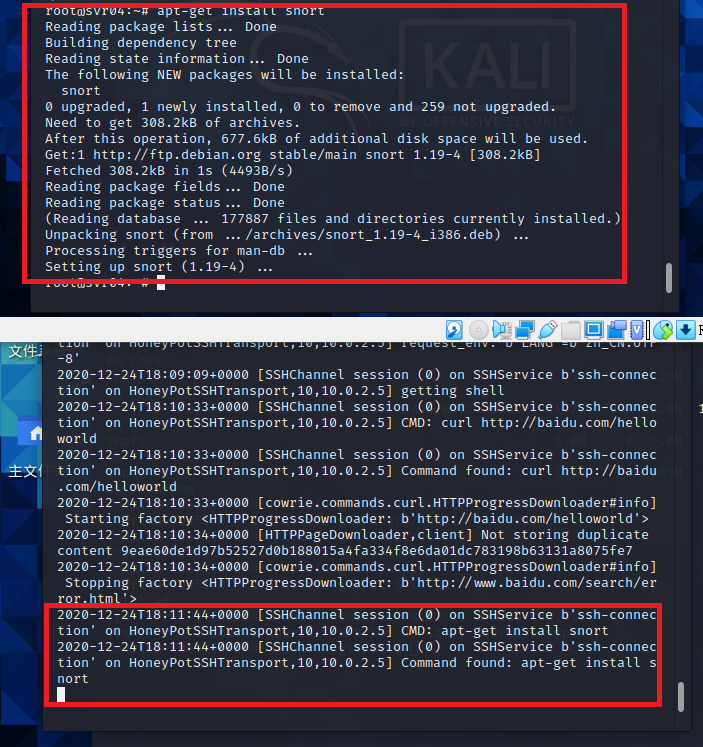 

* 再次下载snort，发现每次都是新下载的，这说明前面下的是假的可执行文件，对于攻击者来说，很有可能就从这里发现蜜罐的存在了。按经验来说，连续的下载得到的回复应该是已安装，而不是新的安装，另外，安装的过程也与正常的安装有所不同

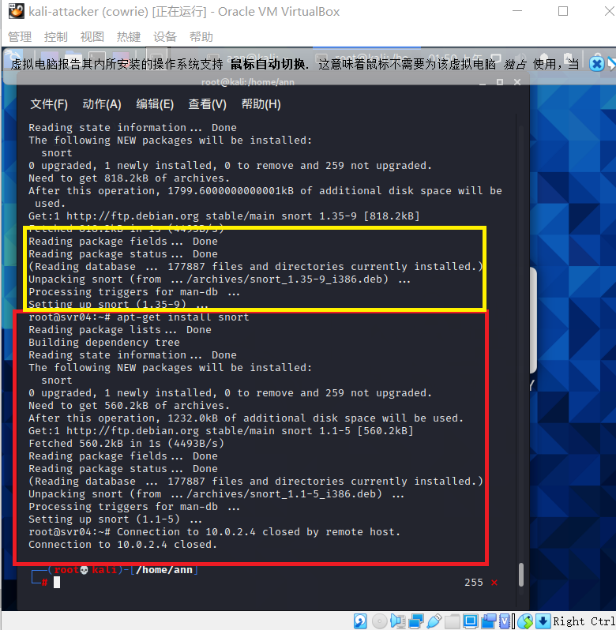

* 检验安装的snort是不是假的，尝试输snort命令，确实没有

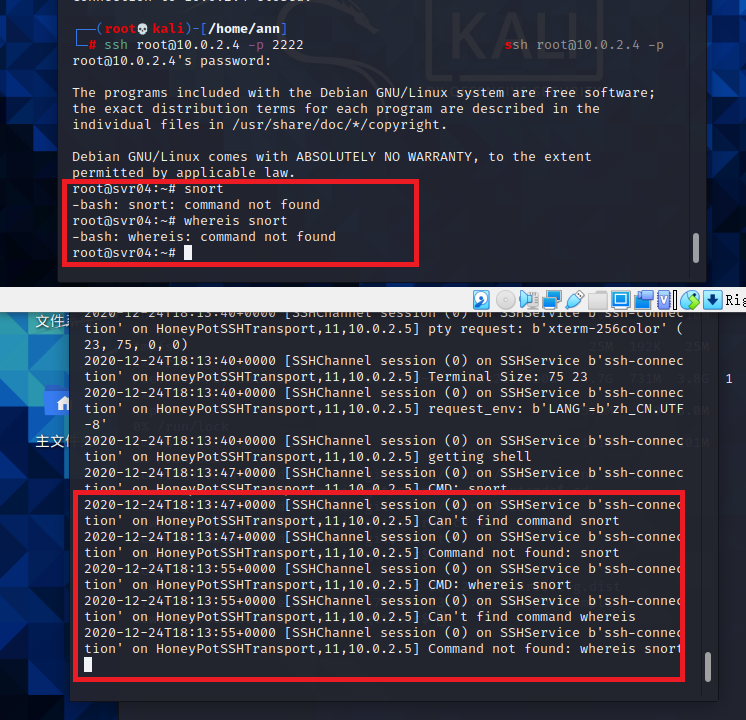

* 尝试对“靶机”进行nmap扫描，发现日志中居然也没有记录下这个信息，扫描的状态结果是开放，而service居然是EthernetIp-1，这显然不符合常理，通过这里也暴露出了蜜罐的存在

```nmap -sX -p 2222 -n -vv 10.0.2.4```

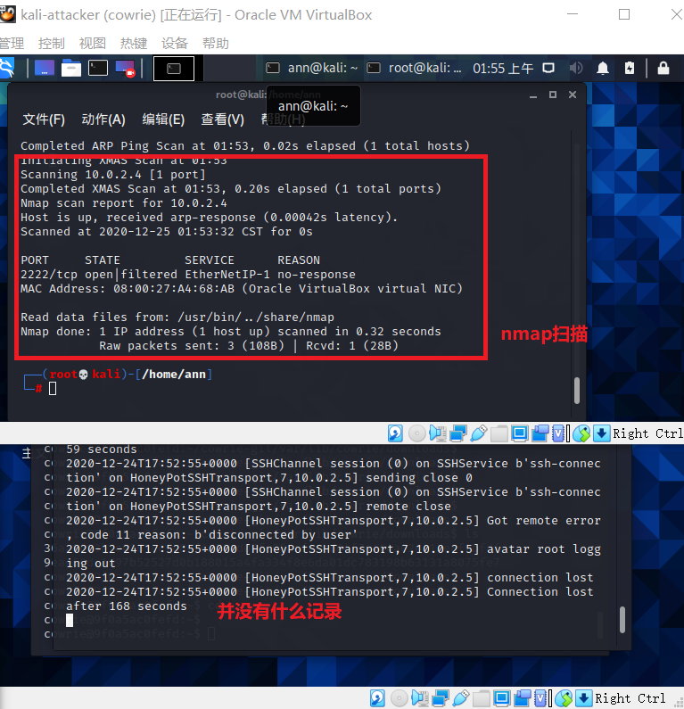 

* 另外，查看一下cowrie的配置文件

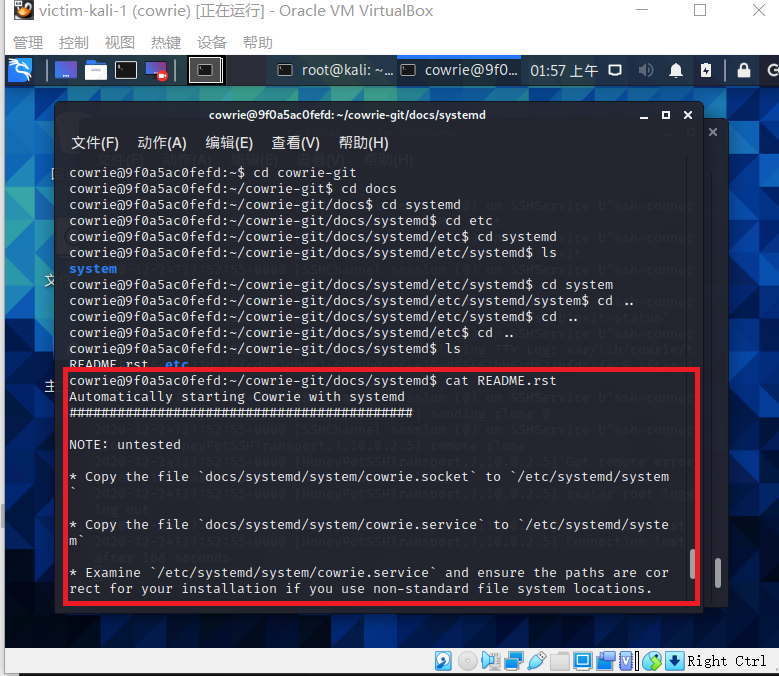 

* 配置文件详细信息如下
```
Automatically starting Cowrie with systemd
###########################################

NOTE: untested

* Copy the file `docs/systemd/system/cowrie.socket` to `/etc/systemd/system`

* Copy the file `docs/systemd/system/cowrie.service` to `/etc/systemd/system`

* Examine `/etc/systemd/system/cowrie.service` and ensure the paths are correct for your installation if you use non-standard file system locations.

* Add entries to `etc/cowrie.cfg` to listen on ports via systemd. These must match your cowrie.socket configuration:

    [ssh]
    listen_endpoints = systemd:domain=INET6:index=0

    [telnet]
    listen_endpoints = systemd:domain=INET6:index=1

* Run:
    sudo systemctl daemon-reload
    sudo systemctl start cowrie.service
sudo systemctl enable cowrie.service
```

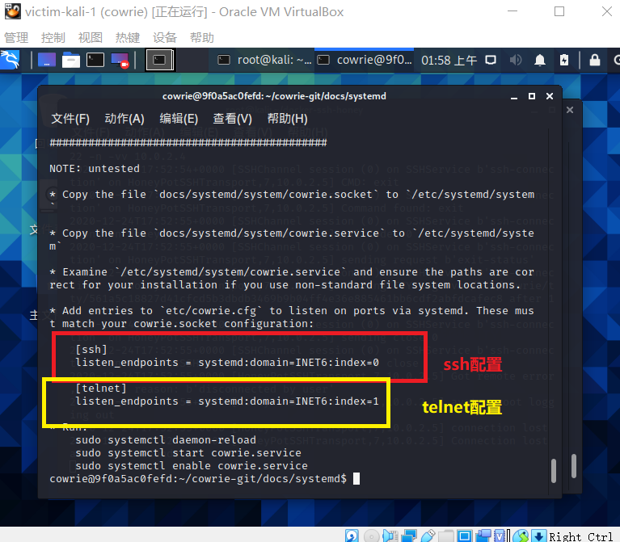

* 查看该蜜罐支持的命令，数目还是不小的

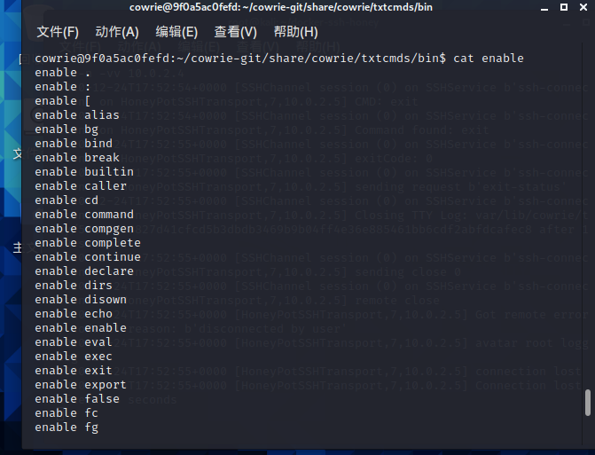 

* 查看文件分区，其实这是蜜罐搭建过程中非常重要的一步，因为攻击者很容易看出一些不太合理的文件分区

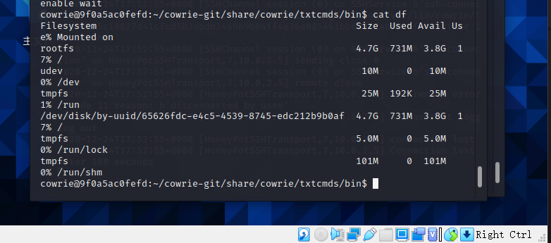 

* 在攻击者主机和容器内查看文件目录如下，在蜜罐容器内可以看到配置文件的信息，而攻击者中看不到，这也符合蜜罐的要求，毕竟这一旦被发现，“蜜罐”的存在也展露无遗了

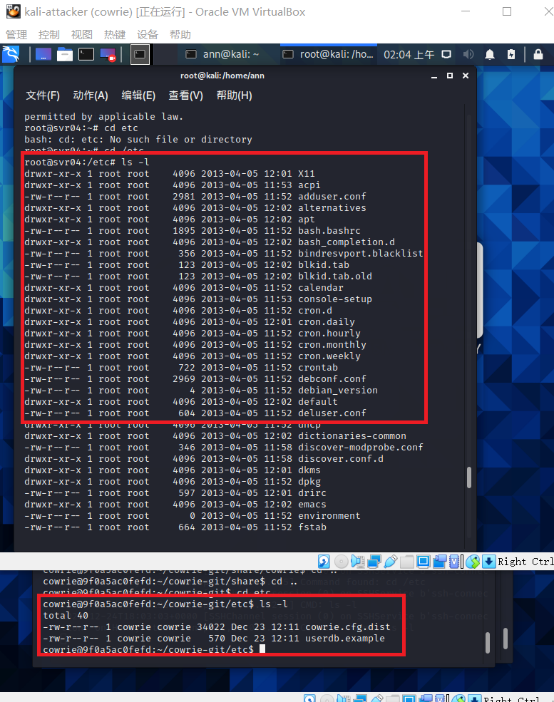 

### 实验总结
* 如何辨别当前目标是一个「蜜罐」
  * 入侵时保持谨慎的态度，细心观察当前环境，并结合之前的使用经验进行比较分析
  * 目标突破的难易程度也可以作为辨别的依据，过于简单或是利用常见漏洞就能进入的目标，可以在很大程度上怀疑其为蜜罐，比如cowrie蜜罐root用户随便输密码就可以进入
  * 如果蜜罐模拟得不够完善，多尝试几个命令，或添加一些选项，就会让其露出马脚
* 常见的蜜罐识别和检测方法
  
  * 对低交互蜜罐的识别，主要集中在模拟技术的检测上（通常存在着较为明显的特征）
  * 高交互蜜罐通常使用虚拟机进行部署，常用虚拟机探测技术进行识别
    * 虚拟机探测的目标：检查当前代码是否正运行在一台虚拟的主机上
    * 可以根据文件系统和注册表中的虚拟机信息、虚拟主机的内存分配特征、虚拟主机的硬件特征及虚拟主机中的特殊指令与通道进行探测
  * 高交互蜜罐通常采用内核级隐藏技术，主要有隐藏模块、隐藏文件、隐藏进程、隐藏连接等技术，可通过对隐藏技术的识别来进行判断

* 通过上述实验，发现ssh-honeypot是一个低交互式的蜜罐，仅用于记录攻击者的信息，而cowrie是一个相对交互式较高、较完善的蜜罐，可以进行ssh远程连接等等一系列“类似真机”的操作。

#### 实验参考资料

* https://c4pr1c3.github.io/cuc-ns/chap0x11/exp.html
* https://www.bilibili.com/video/BV1Nr4y1c7TT?p=14
* https://github.com/CUCCS/2020-ns-public-chenwenwens/blob/chap0x11/chap0x11/%E5%B8%B8%E8%A7%81%E8%9C%9C%E7%BD%90%E4%BD%93%E9%AA%8C%E5%92%8C%E6%8E%A2%E7%B4%A2.md
* https://github.com/CUCCS/2020-ns-public-shiancuc/blob/ns_chap0x11/ns_chap0x11/ns_chap0x11_report.md